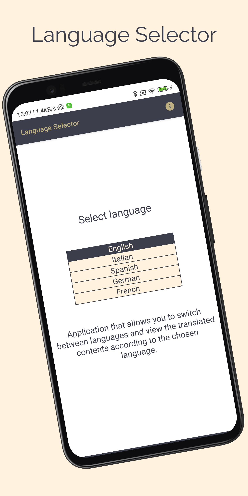

# Language Selector
> <b>Author: Nicola De Nicolais</b>

## 📄 Description
Android application built with Kotlin and Jetpack Compose that allows you to select the language of the displayed text.<br/>

## 🔨  How to install and run the project
Clone this repository :<br/>
`
git clone https://github.com/ndenicolais/LanguageSelector.git
`

Import the project into Android Studio :

1. File -> New -> Import Project
2. Browse to <path_to_project>
3. Click "OK"

Create a new virtual device or connect an Android device to your computer.</br>
Click Run to start the project on the selected device.

## 🛠️ Built with
Kotlin</br>
Jetpack Compose<br>
ViewModel<br>
LiveData<br>
Preferences Datastore<br>
Dagger Hilt

## 📚 Package Structure

```
com.denicks21.languageselector  # ROOT PACKAGE
│
├── repository                  # REPOSITORY FOLDER
|   │   ├── DataStoreRepository # DataStore repository.
│
├── ui.theme                    # THEME FOLDER
|   │   ├── Color               # Color palette used by the app.
|   │   ├── Shape               # Components shapes of Compose used by the app.
|   │   ├── Theme               # Theme used by the app.
|   │   ├── Type                # Typography styles for the fonts used by the app.
│
├── viewmodels                  # VIEWMODELS FOLDER
|   │   ├──LanguageViewModel    # Model that interact with repository class.
|
├── MainActivity                # Main activity
```

## 📌 Customization
In the app, you can add or modify languages, you simply need to modify the strings files present in the "strings" folder. These resources are defined within XML files in the "res/values/" folder with the .xml extension.<br>
To support other languages, you can create copies of the strings.xml file within new "res/values-xx/" folders where "xx" represents the language code.

## 📎 Screenshots
<p float="left">

